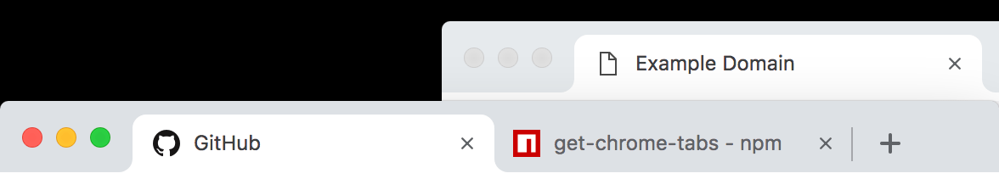

# get-browser-tabs

forked from https://github.com/shinnn/get-browser-tabs/

Get information of the currently opened tabs in a given browser:

Collects:
- url
- title



```javascript
const getBrowserTabs = require('get-browser-tabs');

(async () => getBrowserTabs() /* => [
  {
    browser: 'chrome',
    windowIndex: 0,
    windowVisible: true,
    url: 'https://github.com/',
    title: 'GitHub',
    active: true,
    loading: false
  },
  {
    browser: 'chrome',
    windowIndex: 0,
    windowVisible: true,
    url: 'https://www.npmjs.com/package/get-browser-tabs',
    title: 'get-browser-tabs - npm',
    active: false,
    loading: false
  },
  {
    browser: 'chrome',
    windowIndex: 1,
    windowVisible: true,
    url: 'https://example.org/',
    title: 'Example Domain',
    active: true,
    loading: false
  }
] */)();
```

## Installation

[Use](https://docs.npmjs.com/cli/install) [npm](https://docs.npmjs.com/getting-started/what-is-npm).

```
npm install get-browser-tabs
```

## API

```javascript
const getBrowserTabs = require('get-browser-tabs');
```

### getBrowserTabs([*option*])

*option*: `Object`  
Return: `Promise<Array<Object>>`  

*macOS with [JXA](https://github.com/JXA-Cookbook/JXA-Cookbook#readme) support is required.*

Each object included in the resultant array has the following properties:

* windowIndex `integer` – An index of the window which contains the tab (`0` (foremost), `1`, ...)
* windowVisible `boolean` – Whether the window which contains the tab is visible or not
* url `string` – A URL currently opened by the tab
* title `string` – The tab title
* active `boolean` – Whether the tab is currently selected or not. Each window has one active tab.
* loading `boolean` - Whether the tab is loading or not

It will be rejected when the specified browser is not running.

### option.app

Type: `string` 
one of: canary, chrome, opera, firefox, safari, safari-tech-preview

```javascript
// When Chrome is not running but Chrome Canary is running

(async () => {
  try {
    await getBrowserTabs();
  } catch (err) {
    err.message; //=> 'Tried to get tabs of Chrome, but Chrome is currently not running.'
  }

  await getBrowserTabs({app: 'canary'}); //=> [{windowIndex: 0, windowVisible: true, ...}, ...]
})();

```

## License

[ISC License](./LICENSE) © 2018 Shinnosuke Watanabe
[ISC License](./LICENSE) © 2018 Mark Vayngrib
